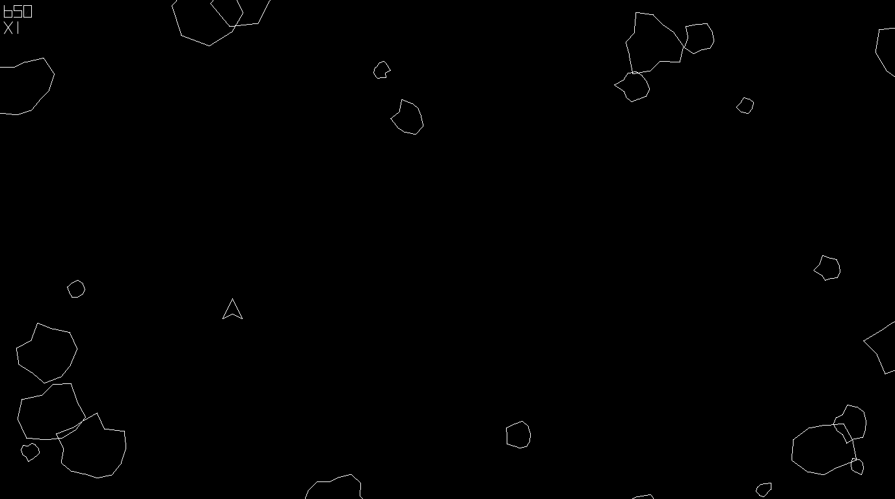

# Asteroids
Clone of 1979 Atari game implemented with Pygame.

## Setup
Clone repository and in `Asteroids` directory type:
```bash
conda env create -f environment.yml
```

## Usage
In `Asteroids` directory type:
```bash
conda activate Asteroids
python main.py
conda deactivate
```

## Controls
Use `arrows` to move ship and `space` to shoot. You can pause the game with `P` and exit the game with `Esc`.

## Screenshots



## Attributions
> [Vector Battle](https://www.dafont.com/vector-battle.font) by [Freaky Fonts](https://www.dafont.com/freaky-fonts.d137)

> [Asteroids Sounds](http://www.classicgaming.cc/classics/asteroids/sounds) from [classicgaming.cc](http://www.classicgaming.cc/)

> [Asteroid B Icon](http://www.iconarchive.com/show/arcade-saturdays-icons-by-mad-science/Asteroid-B-icon.html) by [MadScienceLabs How](http://www.iconarchive.com/artist/mad-science.html)
